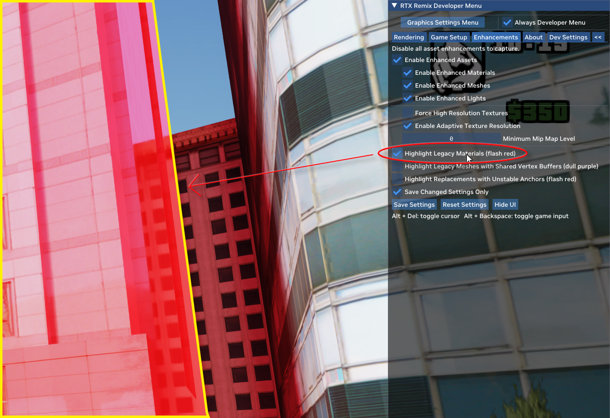

# GTASA RTX-Remix Tools
This tools is use for compare different only between your captures texture folder and rough_only.usda put this in "Your Game Folder\rtx-remix", when you use Highlight Legacy Materials in RTX-Remix in GAME Menu and see a red flashing objects, not include the car materials or anything mark as "terrain Textures" press the capture button, and run this script, than after you restart the game, the flash red object will no longer exists, and the object is not highly reflection now, if you want to help to improve this project your can find a file name "diff_file.data" in "Your Game Folder\rtx-remix", you can send the file or just copy the hash and send to me Discord [Hemry](https://discordapp.com/users/hemry), i will use this hash to publish a new "rough_only.usda" for the community.

